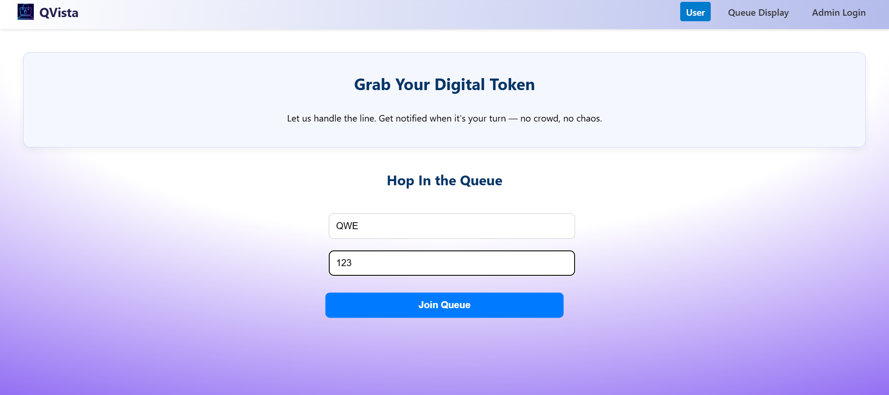

# VirtualQ

**VirtualQ** is a modern online queue management system that enables users to join, manage, and monitor queues virtually. It helps businesses reduce physical crowding and wait times by providing real-time queue updates.

## Features

- **Join Queue**: Users can join a live queue virtually with a single click.
- **Live Updates**: Get real-time updates on your position in the queue.
- **Admin Panel**: Admins can create queues, manage users, and control flow.
- **Responsive UI**: Mobile-first design for smooth experience across devices.

## Tech Stack

- **Frontend**: React.js, Tailwind CSS
- **Backend**: Node.js, Express
- **Database**: MongoDB
- **Hosting**: Vercel (Frontend), Render (Backend)

## Live Demo

🔗 [https://qvista.vercel.app](https://qvista.vercel.app)

## Preview

### Home Page


### Queue Join Page


### Admin Dashboard


## Setup Instructions

1. Clone the repository:
   ```bash
   git clone https://github.com/BavithSuvarna/VirtualQ.git
   ```
2. Navigate into the project directory:
   ```bash
   cd VirtualQ
   ```
3. Install frontend dependencies
   ```bash
   cd client
   npm install
   ```
4. Install backend dependencies
   ```bash
   cd ../server
   npm install
   ```
5. Set up Environment Variables
   Create .env files in both client and server folders (if required) with necessary keys like API endpoints, DB connection strings, etc.
6. Start the application:
     Start the backend server:
     ```bash
     cd server
     npm start
     ```
     Start the frontend app:
     ```bash
     cd ../client
     npm start
     ```
7. Visit the application at http://localhost:3000 in your browser.
